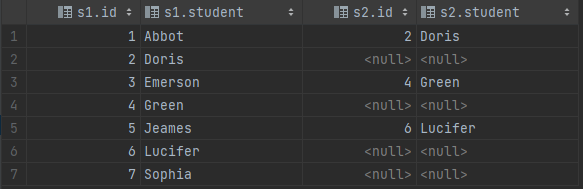
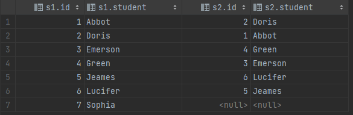

### 练习二: 换座位（难度：中等）

小美是一所中学的信息科技老师，她有一张 seat 座位表，平时用来储存学生名字和与他们相对应的座位 id。

其中纵列的**id**是连续递增的

小美想改变相邻俩学生的座位。

你能不能帮她写一个 SQL query 来输出小美想要的结果呢？

请创建如下所示seat表：

**示例：**

```plain
+---------+---------+
|    id   | student |
+---------+---------+
|    1    | Abbot   |
|    2    | Doris   |
|    3    | Emerson |
|    4    | Green   |
|    5    | Jeames  |
+---------+---------+
```
假如数据输入的是上表，则输出结果如下：
```plain
+---------+---------+
|    id   | student |
+---------+---------+
|    1    | Doris   |
|    2    | Abbot   |
|    3    | Green   |
|    4    | Emerson |
|    5    | Jeames  |
+---------+---------+
```
**注意：**
如果学生人数是奇数，则不需要改变最后一个同学的座位。

### 解析
完整 sql 语句可参考 [sectionA_2.sql](https://github.com/hd2yao/learn-sql/blob/master/datawhale/wonderful-sql/sectionA-2/sectionA_2.sql)

#### 方法一：直接判断
1. 使用 case 对 id 判断
```mysql
CASE
    WHEN MOD(id, 2) = 1 AND id < (SELECT MAX(id) FROM seat) THEN id + 1
    WHEN MOD(id, 2) = 0 THEN id - 1
    ELSE id
END AS id,
```
else 为人数奇数且为最后一个同学


#### 方法二：使用 left join
1. 通过左连结，匹配相邻座位的同学
```mysql
select *
from seat s1
left join seat s2 on s1.id % 2 = 1 and s1.id + 1 = s2.id
```

2. 根据上表，写出交换条件
```mysql
case
    when s1.id % 2 = 1 and s2.id is not null then s2.id
    when s1.id % 2 = 0 then s1.id - 1
    else s1.id
end as id
```

#### 方法二：稍微改变
> 可能运行起来更加复杂，这只是我的一种想法，仅供参考
1. 同样通过左连结，匹配相邻座位的同学
```mysql
-- 这里调整一下连结条件
select *
from seat s1
left join seat s2 on (s1.id % 2 =1 and s1.id + 1 = s2.id) or (s1.id % 2 = 0 and s1.id - 1 = s2.id)
```

2. 根据上表，写出交换条件
```mysql
case
    when s2.id is null then s1.id
    else s2.id
end as id,
```