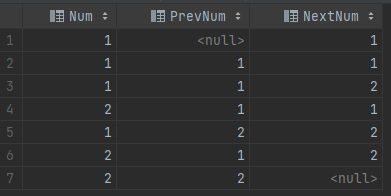
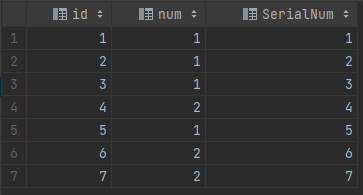
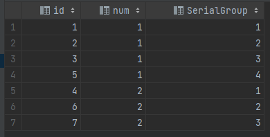
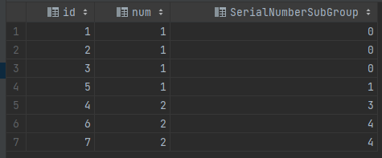

### 练习四：连续出现的数字（难度：中等）

编写一个 SQL 查询，查找所有至少连续出现三次的数字。

```plain
+----+-----+
| Id | Num |
+----+-----+
| 1  | 1   |
| 2  | 1   |
| 3  | 1   |
| 4  | 2   |
| 5  | 1   |
| 6  | 2   |
| 7  | 2   |
+----+-----+
```
例如，给定上面的 Logs 表， 1 是唯一连续出现至少三次的数字。
```plain
+-----------------+
| ConsecutiveNums |
+-----------------+
| 1               |
+-----------------+
```

### 解析
完整 sql 语句可参考 [sectionA_4.sql](https://github.com/hd2yao/learn-sql/blob/master/datawhale/wonderful-sql/sectionA-4/sectionA_4.sql)

#### 方法一：特殊解法（连续三次）
以下提供了两种方法，针对数字连续出现三次的情况
##### 使用 `lag()`、`lead()` 窗口函数
1. `lag()`、`lead()` 分别获取当前行的前一个数字和后一个数字
```mysql
SELECT
    Num,
    LAG(Num, 1) OVER (ORDER BY Id) AS PrevNum,
    LEAD(Num, 1) OVER (ORDER BY Id) AS NextNum
FROM Logs
```

2. 此时 "连续出现三次" 即：**当前行与前一行的数字一集后一行的数字都相同**
```mysql
WHERE Num = PrevNum AND Num = NextNum
```
##### 使用 join
类似于使用 `lag()`、`lead()` 窗口函数
分别使用一个 `join` 来对应上面两个窗口函数
```mysql
JOIN Logs l2 ON l1.Id = l2.Id - 1
JOIN Logs l3 ON l2.Id = l3.Id - 1
```
在 where 中保证三个 num 都相同
```mysql
WHERE l1.Num = l2.Num AND l2.Num = l3.Num
```

#### 方法二：通用方法
上面的方法无法解决下面两种情况：
- 要获取连续出现更多次的数字，连表是不可取的
- 若是 id 不连续，也无法再 where 中筛选


##### 解决 id 不连续的情况
1. 对原始数据重新编号
```mysql
select
    id,num,
    row_number() over(order by id) SerialNum
from logs
```

2. 对 num 分组排序编号
```mysql
select
    id,num,
    row_number() over(partition by num order by id) SerialGroup
from logs
```


##### 获取连续出现更多次的数字
1. **当数字连续，上述两列对应相减的值是相同的**
```mysql
select
    id,num,
    row_number() over(order by id) -
    ROW_NUMBER() over(partition by Num order by Id) as SerialNumberSubGroup
from logs
```

2. 对 `Num` 和 `SerialNumberSubGroup` 分组，统计个数，
```mysql
select
    distinct num as ConsecutiveNums
from
    (
        select
            num,
            row_number() over(order by id) -
            ROW_NUMBER() over(partition by Num order by Id) as SerialNumberSubGroup
        from logs
    ) as Sub
group by
    num,
    SerialNumberSubGroup
having count( 1 ) >= 3;
```
- 还需要对 `num` 分组是因为，有可能会出现 `num` 不同但 `SerialNumberSubGroup` 相同的情况
- `distinct` 是因为，有可能出现同一个数字在多处连续出现次数达标
- sql 的最后一行，计数结果可调整为不同数值，对应 "连续出现 ？ 次"