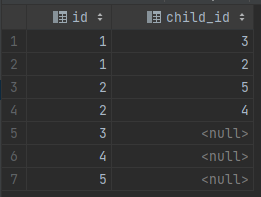

### 练习五：树节点 （难度：中等）

对于**tree**表，*id*是树节点的标识，*p_id*是其父节点的*id*。

```plain
+----+------+
| id | p_id |
+----+------+
| 1  | null |
| 2  | 1    |
| 3  | 1    |
| 4  | 2    |
| 5  | 2    |
+----+------+
```
每个节点都是以下三种类型中的一种：
* Root: 如果节点是根节点。
* Leaf: 如果节点是叶子节点。
* Inner: 如果节点既不是根节点也不是叶子节点。

写一条查询语句打印节点id及对应的节点类型。按照节点id排序。上面例子的对应结果为：

```plain
+----+------+
| id | Type |
+----+------+
| 1  | Root |
| 2  | Inner|
| 3  | Leaf |
| 4  | Leaf |
| 5  | Leaf |
+----+------+
```
**说明**
* 节点 ’1’ 是根节点，因为它的父节点为NULL，有 ’2’ 和 ’3’ 两个子节点。
* 节点 ’2’ 是内部节点，因为它的父节点是 ’1’，有子节点 ’4’ 和 ’5’。
* 节点 ’3’，‘4’，'5’ 是叶子节点，因为它们有父节点但没有子节点。

下面是树的图形：

        1         
      /   \ 
     2    3    
    / \
    4  5

**注意**

如果一个树只有一个节点，只需要输出根节点属性。

### 解析
完整 sql 语句可参考 [sectionA_5.sql](https://github.com/hd2yao/learn-sql/blob/master/datawhale/wonderful-sql/sectionA-5/sectionA_5.sql)

#### 方法一：left join
通过自连表，将 id 作为父节点连结起来
```mysql
SELECT 
    t1.id as id,
    t2.id as child_id
FROM tree t1
LEFT JOIN tree t2 ON t1.id = t2.p_id
```


因此，child_id 为 null 时，节点为叶子节点

#### 方法二：not in
查询存在子节点的 id（去除根节点）
```mysql
SELECT distinct p_id
FROM tree
WHERE p_id IS NOT NULL 
```
那么，不在其中的节点就是叶子节点
```mysql
WHERE id NOT IN (SELECT DISTINCT p_id FROM tree WHERE p_id IS NOT NULL)
```