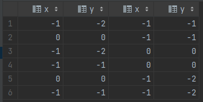

### 练习八：平面上最近距离 (难度: 困难）

**point_2d**表包含一个平面内一些点（超过两个）的坐标值（x，y）。

写一条查询语句求出这些点中的最短距离并保留2位小数。

```plain
|x   | y  |
|----|----|
| -1 | -1 |
|  0 |  0 |
| -1 | -2 |
```
最短距离是1，从点（-1，-1）到点（-1，-2）。所以输出结果为：

| shortest |

1.00

```plain
+--------+
|shortest|
+--------+
|1.00    |
+--------+
```
**注意：**所有点的最大距离小于10000。

### 解析
完整 sql 语句可参考 [sectionA_8.sql](https://github.com/hd2yao/learn-sql/blob/master/datawhale/wonderful-sql/sectionA-8/sectionA_8.sql)

1. 找出所有的两点组合，可使用 **笛卡尔积连接**
```mysql
select *
from point_2d p1
cross join point_2d p2
where p1.x != p2.x or p1.y != p2.y
```


其中 where 语句筛去了点与点自身，但是没有去重

2. 使用勾股定理计算两点之间的距离
```mysql
round(min(sqrt(power(p1.x - p2.x, 2) + power(p1.y - p2.y, 2))), 2)
```