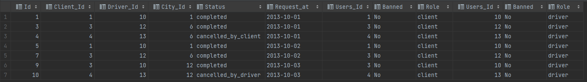

### 练习九：行程和用户（难度：困难）

Trips 表中存所有出租车的行程信息。每段行程有唯一键 Id，Client_Id 和 Driver_Id 是 Users 表中 Users_Id 的外键。Status 是枚举类型，枚举成员为 (‘completed’, ‘cancelled_by_driver’, ‘cancelled_by_client’)。

| Id| Client_Id| Driver_Id| City_Id| Status              | Request_at |
|:--|:---------|:---------|:-------|:--------------------|:-----------|
| 1 | 1        | 10       | 1      | completed           | 2013-10-1  |
| 2 | 2        | 11       | 1      | cancelled_by_driver | 2013-10-1  |
| 3 | 3        | 12       | 6      | completed           | 2013-10-1  |
| 4 | 4        | 13       | 6      | cancelled_by_client | 2013-10-1  |
| 5 | 1        | 10       | 1      | completed           | 2013-10-2  |
| 6 | 2        | 11       | 6      | completed           | 2013-10-2  |
| 7 | 3        | 12       | 6      | completed           | 2013-10-2  |
| 8 | 2        | 12       | 12     | completed           | 2013-10-3  |
| 9 | 3        | 10       | 12     | completed           | 2013-10-3  |
| 10| 4        | 13       | 12     | cancelled_by_driver | 2013-10-3  |

Users 表存所有用户。每个用户有唯一键 Users_Id。Banned 表示这个用户是否被禁止，Role 则是一个表示（‘client’, ‘driver’, ‘partner’）的枚举类型。

```plain
+----------+--------+--------+
| Users_Id | Banned |  Role  |
+----------+--------+--------+
|    1     |   No   | client |
|    2     |   Yes  | client |
|    3     |   No   | client |
|    4     |   No   | client |
|    10    |   No   | driver |
|    11    |   No   | driver |
|    12    |   No   | driver |
|    13    |   No   | driver |
+----------+--------+--------+
```
写一段 SQL 语句查出**2013年10月1日**至**2013年10月3日**期间非禁止用户的取消率。基于上表，你的 SQL 语句应返回如下结果，取消率（Cancellation Rate）保留两位小数。
```plain
+------------+-------------------+
|     Day    | Cancellation Rate |
+------------+-------------------+
| 2013-10-01 |       0.33        |
| 2013-10-02 |       0.00        |
| 2013-10-03 |       0.50        |
+------------+-------------------+
```

### 解析
完整 sql 语句可参考 [sectionA_9.sql](https://github.com/hd2yao/learn-sql/blob/master/datawhale/wonderful-sql/sectionA-9/sectionA_9.sql)

1. 查询符合条件的行程
- `Client_Id` 和 `Driver_Id` 是 Users 表中 `Users_Id` 的外键，因为连结两次 Users 表
- 过滤出 `Client_Id` 和 `Driver_Id` 都未被禁止（`Banned = 'No'`）的记录
- 仅选择在 2013-10-01 至 2013-10-03 之间的行程
```mysql
select
    *
from trips t
left join users uc on t.Client_Id = uc.Users_Id
left join users ud on t.Driver_Id = ud.Users_Id
where uc.Banned = 'no' and ud.Banned = 'no'
  and t.Request_at between '2013-10-01' and '2013-10--3'
```


2. 计算取消率
- 使用 `sum()`、`if()` 来计算
```mysql
round(sum(IF(Status = 'completed', 0, 1)) / count(1), 2)
```

> IF() 可替换为 CASE 
> 
> 使用 sum() 而不使用 count() 是因为只要不为 null，都会被 count() 统计在内