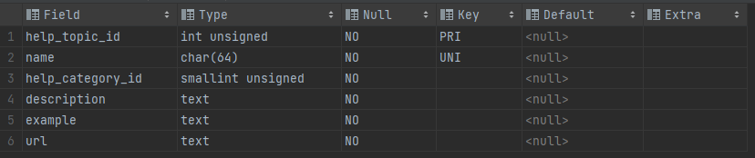

### 练习二：列转行

假设有如下比赛结果：

```plain
+--------------+-----+-----|
|  比赛日期     | 胜  | 负  |
+--------------+-----------+
|  2021-01-01  |  4  |  1  |
|  2021-01-03  |  1  |  4  |
+------------+-----------+
```

请使用 SQL 将比赛结果转换为如下形式：

```plain
+--------------+-----------+
|    cdate     |   result  |
+--------------+-----------+
|  2021-01-01  |     胜    |
|  2021-01-01  |     胜    |
|  2021-01-01  |     胜    |
|  2021-01-01  |     胜    |
|  2021-01-01  |     负    |
|  2021-01-03  |     胜    |
|  2021-01-03  |     负    |
|  2021-01-03  |     负    |
|  2021-01-03  |     负    |
|  2021-01-03  |     负    |
+------------+-------------+
```

### 解析
完整 sql 语句可参考 [sectionC_2.sql](https://github.com/hd2yao/learn-sql/blob/master/datawhale/wonderful-sql/sectionC-2/sectionC_2.sql)

#### 使用 `mysql.help_topic` 表来辅助

`mysql.help_topic` 是 MySQL 数据库自带的帮助表之一

`mysql.help_topic` 表可以用来生成行数据

查询表结构：
```mysql
describe mysql.help_topic
```
