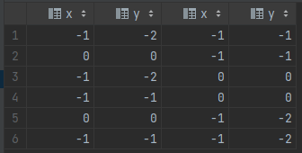

# sectionA-8

#### 练习八：平面上最近距离 (难度: 困难）

**point\_2d**表包含一个平面内一些点（超过两个）的坐标值（x，y）。

写一条查询语句求出这些点中的最短距离并保留2位小数。

```
|x   | y  |
|----|----|
| -1 | -1 |
|  0 |  0 |
| -1 | -2 |
```

最短距离是1，从点（-1，-1）到点（-1，-2）。所以输出结果为：

\| shortest |

1.00

```
+--------+
|shortest|
+--------+
|1.00    |
+--------+
```

\*\*注意：\*\*所有点的最大距离小于10000。

#### 解析

完整 sql 语句可参考 [sectionA\_8.sql](../datawhale/wonderful-sql/sectionA-8/sectionA\_8.sql)

1. 找出所有的两点组合，可使用 **笛卡尔积连接**

```mysql
select *
from point_2d p1
cross join point_2d p2
where p1.x != p2.x or p1.y != p2.y
```



其中 where 语句筛去了点与点自身，但是没有去重

2. 使用勾股定理计算两点之间的距离

```mysql
round(min(sqrt(power(p1.x - p2.x, 2) + power(p1.y - p2.y, 2))), 2)
```
