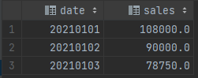
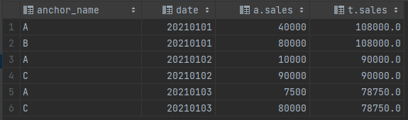
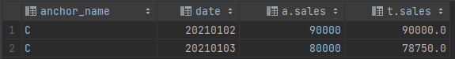

# sectionB-3

#### 练习三：谁是明星带货主播？

假设，某平台2021年主播带货销售额日统计数据如下：

表名 `anchor_sales`

```
+-------------+------------+---------|
| anchor_name |     date   |  sales  | 
+-------------+------------+---------|
|      A      |  20210101  |  40000  |
|      B      |  20210101  |  80000  |
|      A      |  20210102  |  10000  |
|      C      |  20210102  |  90000  |
|      A      |  20210103  |   7500  |
|      C      |  20210103  |  80000  |
+-------------+------------+---------|
```

定义：如果某主播的某日销售额占比达到该平台当日销售总额的 90% 及以上，则称该主播为明星主播，当天也称为明星主播日。

请使用 SQL 完成如下计算：

a. 2021年有多少个明星主播日？

b. 2021年有多少个明星主播？

#### 解析

完整 sql 语句可参考 [sectionB\_3.sql](../datawhale/wonderful-sql/sectionB-3/sectionB\_3.sql)

**1.子查询查询每日达标销售额**

```mysql
select 
    date, sum(sales) * 0.9 as sales
from anchor_sales
group by date
```



**2.left join**

通过日期连结

```mysql
select anchor_name, a.date, a.sales, t.sales
from anchor_sales a
    left join (select date, sum(sales) * 0.9 as sales
               from anchor_sales
               group by date) as t
        on a.date = t.date
```



**3.根据题目要求查询相应的数据**

```mysql
where a.sales >= t.sales
```


