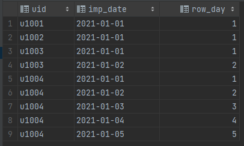
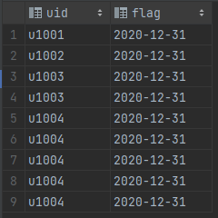
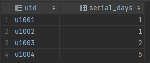

# sectionC-3

#### 练习三：连续登录

有用户表行为记录表t\_act\_records表，包含两个字段：uid（用户ID），imp\_date（日期）

1. 计算2021年每个月，每个用户连续登录的最多天数
2. 计算2021年每个月，连续2天都有登录的用户名单
3. 计算2021年每个月，连续5天都有登录的用户数

#### 解析

完整 sql 语句可参考 [sectionC\_3.sql](../datawhale/wonderful-sql/sectionC-3/sectionC\_3.sql)

**计算用户连续登录天数**

1. 对用户分组，然后组内排序

```mysql
select *,
       row_number() over (partition by uid order by imp_date) row_day
from t_act_records
order by uid
```



2. 用日期减去排序序号

若是存在连续的日期，减去后的结果应是相同的

```mysql
select
    t1.uid,
    date_sub(imp_date, interval row_day day ) as flag
from
    (
        select *,
               row_number() over (partition by uid order by imp_date) row_day
        from t_act_records
        order by uid
     ) t1
```



3. 计算每个组内相同 flag 的个数，即为连续登录天数

```mysql
select
    uid, count(*) as serial_days
from
    (
        select
            t1.uid,
            date_sub(imp_date, interval row_day day ) as flag
        from
            (
                select *,
                       row_number() over (partition by uid order by imp_date) row_day
                from t_act_records
                order by uid
             ) t1
    ) t2
group by uid,flag;
```



4. 查询连续登录 n 天的用户

只需要筛选相应天数即可，以下为连续登录两天的用户：

```mysql
select
    uid
from
    (
        select
            t1.uid,
            date_sub(imp_date, interval row_day day ) as flag
        from
            (
                select *,
                       row_number() over (partition by uid order by imp_date) row_day
                from t_act_records
                order by uid
            ) t1
    ) t2
group by uid,flag
having count(flag) >= 2
```

> 以上参考： [SQL脚本案例【1】连续登录3天的用户](https://mp.weixin.qq.com/s/hGYFaUK-qSJWWCf8T4aejQ)
