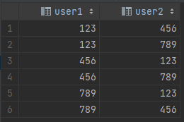
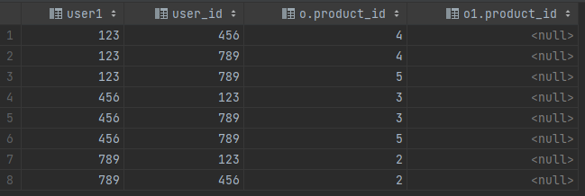

# 练习四：用户购买商品推荐

假设现在需要根据算法给每个 `user_id` 推荐购买商品，推荐算法比较简单，推荐和他相似的用户购买过的 `product` 即可，说明如下：

* 排除用户自己购买过的商品
* 相似用户定义：曾经购买过 2 种或 2 种以上的相同的商品

输入表：`orders`

```
+---------+------------+
| user_id | product_id |
+---------+------------+
|     123 |          1 |
|     123 |          2 |
|     123 |          3 |
|     456 |          1 |
|     456 |          2 |
|     456 |          4 |
|     789 |          1 |
|     789 |          3 |
|     789 |          4 |
|     789 |          5 |
+---------+------------+
```

输出表：

```
+---------+------------+
| user_id | product_id |
+---------+------------+
|     123 |          4 |
|     123 |          5 |
|     456 |          3 |
|     456 |          5 |
|     789 |          2 |
+---------+------------+
```

## 解析

完整 sql 语句可参考 [sectionC\_4.sql](../datawhale/wonderful-sql/sectionC-4/sectionC\_4.sql)

### 找出相似用户

```mysql
SELECT
     a.user_id AS user1,
     b.user_id AS user2
 FROM
     orders a
         JOIN
     orders b ON a.product_id = b.product_id AND a.user_id <> b.user_id
 GROUP BY
     a.user_id, b.user_id
 HAVING
         COUNT(DISTINCT a.product_id) >= 2
```



### 排除用户自己购买过的商品

* 先 `join orders` 表，找到其相似用户购买过的商品
* 然后 `left join` orders 表，以及 `WHERE o1.product_id IS NULL` 来排除用户自己已经购买过的商品

```mysql
SELECT
    su.user1,
    o.user_id,
    o.product_id,
    o1.product_id
FROM
    (
        SELECT
             a.user_id AS user1,
             b.user_id AS user2
         FROM
             orders a
                 JOIN
             orders b ON a.product_id = b.product_id AND a.user_id <> b.user_id
         GROUP BY
             a.user_id, b.user_id
         HAVING
                 COUNT(DISTINCT a.product_id) >= 2
     ) su
JOIN
    orders o ON su.user2 = o.user_id
LEFT JOIN
    orders o1 ON su.user1 = o1.user_id AND o.product_id = o1.product_id
where o1.product_id is null
order by user1;
```



* 最后只需要去重即可
